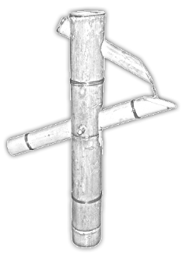

# The Sozu table, a blockchain-centric data structure for the UTXO dataset of Bitcoin

> By Joannes Vermorel, Lokad, March 2018 (minor revision August 2018)

_In the present document, Bitcoin refers to Bitcoin Cash._

**Abstract:** Bitcoin has the ambition to scale on-chain up to millions of transactions per second. Scaling the blockchain entails varied challenges. We present the Sozu table, a high-density I/O optimized data structure intended for the UTXO dataset (unspent transaction outputs). Unlike a traditional key-value store, the Sozu table levarages the Lindy effect, as UTXO entries have a temporal dimension. The Sozu table is a layered hashtable designed to max-out a mix of data storage technologies. The I/O strategy of the Sozu table is aligned with the underlying hardware design. 



_The name Sozu reflects that each bucket gradually accumulates key-value entries until the bucket is full, in which case, a significant portion of the content flows downstream, to the next layer of the table, just like water in a Japanese fountain._

## Introduction

The historic implementation of Bitcoin, referred to as the _Satoshi client_, does not readily support on-chain scaling, that is, the possibility to process up to millions of transactions on-chain per second. In particular, while the blockchain is, as the name suggests, a series of blocks, the most critical piece of data that needs to be managed by a Bitcoin node is the UTXO dataset, the dataset of unspent transaction outputs.

A Bitcoin transaction includes a list of inputs and outputs, and the Bitcoin monetary value flows from inputs to outputs. Each input connects to a single former transaction output. The connection between a former output and a new input relies on a cryptographic signature mechanism which goes beyond the present discussion. This represents the cryptographic validation of the transactions.

The economic validation of an incoming transaction consists in checking whether all its inputs are connecting to _unspent_ outputs, and that the total amount to be pushed to its outputs does not exceed the total monetary value of the inputs. The residual monetary difference between the inputs and the outputs is the _miner fee_ which also goes beyond the scope of the present paper.

Managing the UTXO dataset is of primary importance, because querying this dataset enables the economic validation of the Bitcoin transactions. Conceptually, the UTXO dataset is nothing more than a key-value store, where:

* each key is an _outpoint_, a tuple that includes a transaction ID (TxID of 32 bytes) and an output index (integer of 4 bytes). The index reflects that a given transaction can have multiple outputs.
* each value is a _payload_, which, among other things, includes a script to later cryptographically claim the output, which can be up to 10,000 bytes (in practice much smaller though).

Then, Bitcoin transactions are packed by _blocks_, where a block is nothing more than a list of transactions. Thus, the UTXO dataset is _conceptually_ updated in large batches at each block boundary, and its integrity only needs to be guaranteed at those boundaries.

The management of the UTXO dataset is further complicated in practice as the blockchain is not a strictly linear chain of blocks. Indeed, race conditions do happen, albeit at a low frequency of a few blocks per 1000, and sometimes there are multiple blocks competing to extend the blockchain. As the Bitcoin consensus mechanism states that the longest chain of blocks should be favored, when such a race condition happens, within a short number of blocks, all chains - but the longest - get _orphaned_. Thus, while the blockchain is dominantly a linked list of blocks, it does exhibit some tree-like behavior at its tip. 

In order to manage the UTXO dataset, the Satoshi client uses a relatively straightforward mechanism of _block-do_ and _block-undo_ which represents explicitly batched updates for the UTXO dataset. This mechanism offers the possibility to switch from one tip of the blockchain to another. However, this performance penalty is roughly linear to the total size of all the blocks involved in the blockchain reorganization (both new blocks and orphaned blocks).

## The UTXO challenge

We seek an architecture for the UTXO dataset that makes on-chain scaling as practical and cost-efficient as possible. Indeed, scaling a generic key-value store to millions of reads/writes per second with linear hardware costs is already possible (1), but in the specific case of Bitcoin, a specialized solution can deliver a better constant factor on the hardware costs. In particular, beyond a generic key-value store, we seek:

* an efficient balance of I/O vs storage: the better I/O, the more expensive the storage cost per MB. The architecture should be capable of managing a series of data storage devices, offering distinct trade-offs.
* an overall data storage efficiency: the amount of data stored should be as close as possible to the minimal theoretical limit for the UTXO dataset, which is the serialized list of key-values.
* a quasi-constant latency for all operations, including orphaning blocks. Similarly, the architecture should not be expected to require any "pause" of any kind. Such a property eliminates entire classes of problems, including the need to further mitigate potential denial-of-service attack vectors.

To a large extend, generic NoSQL solutions could be tuned to deliver many, if not most, of those properties. Yet, streamlining a specialized solution dedicated to the UTXO problem should provide a better constant factor on all the relevant dimensions.

## The Sozu table

The Sozu table is introduced as a specialized data structure intended for the management of the UTXO dataset. It can be seen as a layered hash table, which gradually lets older entries - as defined by their block height - sink from one layer to the next.

A data structure for the UTXO dataset needs to address two key concerns. First, it needs to lower its IOPS requirements as much as possible; writing or reading each new TXO entry should require as few I/O as possible; and have those I/O concentrated on the hardware devices delivering the most IOPS for the lowest cost. Second, its also needs to lower its data storage requirements as much as possible; keeping the amount of data storage required as close as possible to the incompressible linear serialized representation of the UTXO dataset.

The Sozu table is designed around the following insights:

* on nearly all data storage devices, data cannot be accessed at the byte level; instead, whenever a byte is read, physically the device retrieves a buffer of 4kB or larger. The Sozu table explicitly takes advantage of this property of the underlying storage hardware, in order to reduce its IOPS requirements.
* all writes do not need to be immediately durable; durability is only required to be guaranteed at the block boundaries in the Bitcoin context. In exchange for more restricted durability guarantees, the Sozu table reduces its IOPS requirements.
* data storage technologies offer varying economic trade-offs, where the options delivering the most IOPS are also the ones with higher _per GB_ costs. The hierarchical design of the Sozu table is naturally suitable to have each layer supported by potentially distinct data storage devices.
* the Lindy effect implies that old UTXO entries are also the ones that are most likely to live the longest. Thus, the layers offering the most IOPS are dedicated to the fresh UTXOs, while the layers that offer the best _per GB_ cost, are dedicated to old UTXOs.
* by decorating the TXO entries with their lifecycle metadata, the Sozu table can gracefully and lazily handle the limited contention that exists on the tip of the blockchain. Multiple chain tips can coexist and compete for the same hardware resources, until Bitcoin settles for the one chain deemed longest.

The Sozu table offers the possibility to query not just one UTXO dataset, but _all_ the _recent_ UTXO datasets. This capability is important to gracefully handle competing tips of the blockchain.

The following graph illustrates the high-level organization of the Sozu table. The Sozu table organizes its entries across multiple layers. Each layer contains many buckets. Each bucket has a reference to a bucket range in the next layer.

Each bucket has also a _maximum production block height_ value which identifies the highest block height observed for an entry in one of its children. This value plays an important in role in optimizing writes.


The Sozu table stores key-value pairs, where the keys are _outpoints_, the binary concatenation of the TxID and the output index. Then, the values are the _payload_, which includes: 

* the monetary amount in satoshis of the TXO (transaction output), 
* the script intended for later cryptographic validation to claim the UTXO,
* the list of _production_ blocks, where the TXO is added to the UTXO set,
* the list of _consumption_ blocks, where the TXO is removed from the UTXO set.

By listing both production and consumption blocks, the entire lifecycle of a TXO can be represented in the Sozu table. Indeed, when considering a chain of blocks, a given TXO can only be produced once and consumed once - possibly in the same block. However, at the tip of the blockchain, there might be some transient chains that compete. Thus, the same TXO can be produced in _multiple_ blocks, and possibly consumed in multiple blocks as well.

In other words, the Sozu table _soft deletes_ its entries by marking them as _consumed_. Then, when the entries are old enough, blockchain-wise, they are lazily _hard deleted_. This point is covered in greater detail in the following.

Blocks cannot be identified only by their block height. However as the Bitcoin protocol steers the generation of new blocks toward 10min intervals between blocks, 4-bytes integers are sufficient to uniquely identify all blocks in existence, including all the orphaned ones, for over 50,000 years.

## Reading the Sozu table

The Sozu table is built from a series of layers. Each layer contains a list of buckets. When moving from one layer to the next (downward), the number of buckets is increased by a power of 2 greater than 1. Except for the first layer, the buckets are lazily instantiated; thus, empty buckets require no data storage.

The read process is a recursive descent into the table until the key is found or there is nothing left to explore - because children are _nil_, in which case _nil_ is returned to indicate that no such key exists in the Sozu table.

The first layer of the Sozu table, but only the first, is essentially similar to a regular hash table. Through a hash function, an _index_ can be obtained from any key, and this index identifies a bucket, where the desired value can be found. Each bucket covers a segment of the _hash range_, and all those segments have the same length.

However, unlike a hash table, each bucket of the Sozu table contains a reference pointing to a range of buckets to be found in the next layer. This range of buckets is referred to as the _children_ of the original bucket. The children cover the same hash range as the one associated to their parent but further sub-partitioning the hash space. A bucket can have a _nil_ reference to refer to its children. A _nil_ reference indicating that all the children are empty, and thus not instantiated yet.

Querying the Sozu table can be done with the pseudo-code of `ReadSozu()` as illustrated below.

```
ReadSozu(k, b, h)
{
    B = ReadBucket(b)

    if(ContainsKey(B, k))
    {
        return B[k]
    }
    else
    {
        if(h > Height(B))
        {
            return nil
        }

        s = ChildrenOf(B)

        if(s is nil)
        {
            return nil
        }
        else
        {
            c = find x in s 
              where Hash(k) in HashRange(x)
            
            return ReadSozu(k, c, h)
        }
    }
}
```

The argument `k` is a key - i.e. an outpoint. The argument `b` is a reference to a bucket whose hash range covers `k`. As the first layer of the Sozu table behaves like a regular hash table, the initial bucket `b` can be inferred from the key `k` itself. The argument `h` is a query filter than defines the minimal block height for a production block identifier associated to the outpoint `k`. In order to omit the block height filter completely, one can use `h=0`.

The helper method `ContainsKey()` checks whether a bucket contains a key matching the key passed as argument. The inner data structure of the bucket matters little to the overall performance, as the bucket is read as a whole, so a sequential exploration of the bucket to seek a key has little overall impact on the performance.

The helper method `Height()` returns the highest block height of any production block associated to any entry found in the children of the bucket. This value is pre-computed and part of the bucket itself. The Sozu table ensures that this value is properly maintained during _write_ operations.

The helper method `Hash()` computes the hash associated with the key, and `HashRange()` computes the segment of hash values covered by the bucket.

In terms of performance, the one operation that is expected to dominate all costs in `ReadSozu()` is the one call to `ReadBucket()` at the beginning of the method. Indeed, it is expected that I/Os largely dominate all other processes (eg. parsing the binary content of the buckets themselves). Thus, the cost of `ReadSozu()` is essentially defined by the number of layers which need to recursively be explored.

Yet, in practice, it would be misleading to consider that the performance is "linear" in the depth of the Sozu table: depending on the specific data storage device used to store a layer, the latency to retrieve one bucket can vary from 1ns to 20ms depending on the hardware being used.

The worst case is when the key is missing from the Sozu table altogether. Thus, in practice, a Sozu table is intended to be used along with a compact probabilistic filter such as a Cuckoo filter (2) in order to efficiently reject the majority of the non-existent keys.

In terms of parallelization, the `ReadSozu()` method obviously benefits from batching the _read_ of many keys at once. Indeed, some keys will collide at the bucket-level, which will reduce the overall I/O requirements, as each bucket will be read at most once.

## Writing to the Sozu table

Writing to the Sozu table is marginally more complicated than reading from it. This write operation is the one that motivated the name _Sozu_ in the first place.

From the Sozu table perspective, a _write_ operation is performed assuming that the longest chain is known as part of the context of the execution. The longest chain is used to decide when dead entries - spent TXOs - can be safely deleted from the Sozu table.

The write process is recursive, just like the read, however, unlike a classical hash table, the buckets are assumed to have a fixed capacity defined at the layer level (each layer can have its own specific bucket capacity). Thus, when trying to add a new entry, a bucket can _overflow_ its capacity.

When a bucket overflows, first, a fraction of its entries is moved downward, and second, the bucket is updated. In practice, making the Sozu table resilient against data corruption caused by power loss require a specific write pattern, which go beyond the scope of this document.

For any outpoint intended to be written, the Sozu table expects that either a _proof of existence_ or a _proof of absence_ to be computed prior calling `WriteSozu()`. The probabilistic filter (e.g. [2]) is expected to provide a proof of absence for the bulk of the outpoints that do not exist in the Sozu Table. Then, the method `ReadSozu()` is intended to be used in batch mode in order to obtain the remaining proofs. At the end of this process, all entries are properly qualified as present or absent, and no _write_ operation should take place between this process and `WriteSozu`, as given by the pseudo-code below.

The method `MergeEntries()` used by `WriteSozu()`, as the name suggests, merges the content of the newer entries into the buckets. The pseudo-code of this method is detailed further below. We are using the term _merge_ because some of the information contained in the entries might already be present in the buckets. For example, the _script_ associated with a TXO might already exist, in which case the merge results in adding one more production or consumption event (identified by a block identifier). In this case, the script as found in the new entries and as found in the bucket should be identical, otherwise the _write_ operation itself is invalid.

```
WriteSozu(e, r)
{
    B = ReadBucketRange(r)
    B = MergeEntries(e, B)

    for each bucket b in B 
    {
        if(IsOverflowing(b)) // flow down
        {
            (f, b) = GetSpill(b)
            
            s = ChildrenOf(b)
            if(s is nil)
            {
                (s, b) = AllocateChildren(b)
            }

            WriteSozu(f, s)
        }
    }

    WriteBucketRange(B)
}
```

The argument `e` contains a list of triplets to be merged into to the Sozu table: the keys (noted `k`) are the outpoints, the values are the regular _payloads_ (noted `v`) and the proofs given as _flags_ (noted `m`). If `m=0`, then the outpoint is guaranteed _absent_ from fragment of the Sozu table covered by `r`. Conversely, if `m=1` then the outpoint is guaranteed _present_. The argument `r` is a range that is assumed to be covering all the hash space of the keys found in `e`.

The method `IsOverflowing()` returns _true_ if the memory footprint of the entries in the bucket exceeds its data storage capacity; or if at least one entry is marked with `m=1`. When a bucket overflows, it has to be spilled, at least partially, to the next layer.

The method `GetSpill()` returns two elements. First, it returns `f` the entries that are intended to flow to the next layer, which always include the entries marked with `m=1`. Second, it returns a shallow copy of the bucket `b` where the entries flowing downward have been removed. Finally, the method ensures that the entries that remain in the bucket `b` do not exceed its capacity. 

The method `GetSpill()` also ensure that the _maximum production block height_ value of `b` is adjusted to reflect its revised value that depends on the entries found in `f` and the original value for `b`. Notably, for any given bucket `b`, this value can only increase over time.

The method `AllocateChildren()` returns two elements. First, it returns a reference `s` to a new range of empty buckets allocated in the next layer, positioned below `b`. Second it returns a shallow copy of the bucket `b` that properly refers to `s` for its children. A lazy allocation of the buckets is important in order to avoid accidentally inflating the data storage requirement of the Sozu table by a large constant factor by requiring the last layer to be fully allocated while it only contains a small number of non-empty buckets.

In terms of performance, the two operations that dominate are `ReadBucketRange()` and `WriteBucketRange()` which require the underlying data storage device to be accessed. Then, the number of recursive calls heavily depends on the frequency and depth of the recursions. The performance also depends on properly choosing the ratio of entries flowing downward. This point is discussed in greater detail in the next section.

The method `MergeEntries()` returns the sequence of revised buckets that integrate the new entries, but where the "dead" entries have been removed as well. The pseudo-code of the method `MergeEntries()` is given below.

```
MergeEntries(e, B)
{
    for each bucket b in B
    {
        // integration loop
        for each (k, v, m) in e 
          where Hash(k) in HashRange(b)
        {
            if(ContainsKey(b, k))
            {
                b = Merge(b, (k, v, 0) )
            }
            else
            {
                b = Add(b, (k, v, m) )
            }
        }

        // purge loop
        for each (k, v, m) in b
        {
            if(IsPermanentlyConsumed(v))
            {
                b = Remove(b, k)
            }
        }

        yield return b
    }
}
```

The purpose of the integration loop is to merge the information brought by the newer entries into the buckets. The method `MergeEntries()` takes as argument `e`, a list of key-value pairs, and `B` a list of buckets.

Each bucket can be enumerated as a triplet `(k, v, m)` of outpoint, payload and proof flag. The triplet obtained from reading the bucket are always read with `m=0`; only extra entries originally passed as argument to `WriteSozu()` may be non-zero.

The helper method `Merge()` is intended for the case where the outpoint is found in the bucket. This method provides a shallow copy of the original bucket `b` where the two values associated to the same key `k` are merged, as the simple union of the lists of productions and consumptions, with a flag set at `m=0`. 

If the outpoint `k` is not found, then the triplet is added to the bucket with its original flag `m`. Only entries marked with `m=1` are automatically spilled downward, the other entries are potentially spilled as well, but according to the prioritization detailed in the next section.

The purpose of the purge loop is to eliminate old TXOs that have already been consumed, and that due to their age - block-wise - aren't going to come back. 

The helper method `IsPermanentlyConsumed()` implicitly depends on a longest chain which is expected to be known as part of the execution context of the method itself. The pseudo-code above is omitting this context for the sake of readability. We suggest to use 100 blocks from the largest block height ever observed as a default heuristic to purge spent TXOs. This constant is chosen because the chain length used to grant their maturity to coinbase outputs is also 100. 

In practice, this constant is expected to have a limited performance impact as long as it is kept below 10,000. The longest chain reorganization observed in Bitcoin was 31 blocks (7)  due to a bug in the Satoshi client back in 2013. However, the longest non-pathological block reorganization observed so far was 4 blocks.

## Tuning the flow between layers

During a write operation, when a bucket overflows its capacity, some of its content needs to flow downward to the next layer of the Sozu table.

If overflowing buckets are fully emptied, then, on average, the buckets of the Sozu table are only half used. This means that half of the actual data storage capacity consumed by the Sozu table would be wasted through partially empty buckets. Also, it means that the average cost of read operations would be increased, as read operations would have, on average, to descend further into the Sozu table.

Thus, we recommend, for each layer $i$ to define the ratio $\alpha_i\in[0,1[$ of entries that will not flow downward when a bucket overflows. Then, in order to prioritize which entries should flow _first_, we suggest a lexicographical ordering of the entries based on a tuple built of:

* 0 if the entry is consumed on all known chains, 1 otherwise.
* the highest block height of the production blocks attached to the entry.
* the outpoint interpreted as a number

This prioritization ensures that TXOs that are most likely to stay _spent_ flow first. Indeed, as double-spend attempts should be rare - precisely because those attempts don't succeed - those entries are not likely to be needed anymore.

Then, for the entries that remain, the most anciently produced TXOs should flow first. Indeed, as a general statistical behavior, the expected lifetime duration of a given UTXO entry increases with the duration it has already spent in the UTXO dataset. This idea is fundamentally similar to the one backing generational garbage collection (6).

In practice, tuning the Sozu table is quite hardware dependent and involves choosing a number of layers, and for each layer:

* a number of buckets
* a bucket capacity
* a flow ratio

From one layer to the next, the number of buckets should grow by a power of 2, as it presents multiple practical benefits. Then, the bucket capacity as well as the flow ratio are expected to increase or remain the same.

## Correctness of the Sozu table

The Sozu table does not exactly behave like a classic hash table, as they are multiple layers involved. However, like a hash table, a key can only exists in one place within a Sozu table.

Unicity of the keys within the Sozu table is guaranteed through the flags of proven existence or absence. Keys that are guaranteed to be absent in the table can be introduced in any layer of the table. Keys that are guaranteed to be already present, and recursively propagated until their matching layer is found. Finally, when entries flow downward, they are also removed from their upper layer, in order to maintain the unicity invariant.

Keys, and their values, are only removed when their production-consumption cycle is long completed within the block chain, which ensure that this spent TXO cannot be resurrected as unspent TXO.

## Sharding the Sozu table

There are multiple ways that can be used to adjust the Sozu table to make it suitable to sustain a highly concurrent I/O throughput. One of the simplest approaches consists of sharding the Sozu table according to the hash space; partitioning the whole Sozu table into multiple Sozu sub-tables (the shards), each shard operating over its own hash segment in complete autonomy.

This approach allows the process to assign a single static thread executing both reads and writes on the shard. This presents the notable advantage of simplicity, as concurrent multithreaded logic is notoriously hard to debug. Moreover, most guarantees provided by modern programming languages like Rust (3) only operate on the memory model, and those guarantees do not extend to data storage devices that are fundamentally outside the memory of the process.

Then, acting as front-end to the Sozu table, a producer-consumer pool can be used to distribute both reads and writes in a scalable manner to all the shards.

## Volatile layers

In order to reduce the I/O pressure on the data storage devices, we suggest to keep the first (and possibly the second) layers in memory. As the memory is volatile, this puts the Sozu table at risk of permanently loosing data in case of a transient problem such as a power loss.

Yet, due to the Bitcoin context, the Sozu table does not need to be durable after each individual _write_ operation, it only needs to be durable at the boundaries of the Bitcoin blocks.

Thus, when a block boundary is reached, the volatile layers need to be copied to the data storage devices. This process can be done efficiently, as each volatile layer can be concurrently streamed to all the devices that are available to receive a copy of the data. As a result, ensuring the durability of a block is only limited by the total bandwidth of all the storage devices. In practice, the IOPS are a bigger constraint than the bandwidth, as sequential writes at 4.8GB/s are achieved by a single PCI device (5), while only 132k IOPS are offered on the same device.


## References

* (1) Revisiting 1 Million Writes per second, Christos Kalantzis, Netflix, July 2014, [link](https://medium.com/netflix-techblog/revisiting-1-million-writes-per-second-c191a84864cc)

* (2) Cuckoo Filter: Practically Better Than Bloom, Bin Fan, David G. Andersen, Michael Kaminsky, Michael D. Mitzenmacher, December 2014, [link]( https://dl.acm.org/citation.cfm?id=2674005.2674994)

* (3) Fearless Concurrency with Rust, Aaron Turon, April 2015, [link](https://blog.rust-lang.org/2015/04/10/Fearless-Concurrency.html)

* (4) Building Scalable Producer-Consumer Pools based
on Elimination-Diffraction Trees, Maria Natanzon, July 2010

* (5) Seagate Data Sheet: Nytro 5910 NVMe SSD, January 2018, [link](https://www.seagate.com/files/www-content/datasheets/pdfs/nytro-5910-nvme-ssdDS1953-3-1801US-en_US.pdf)

* (6) H. Lieberman and C. E. Hewitt. A Real-Time Garbage Collector based on the Lifetimes of Objects. Communications of the ACM, 26(6):419–429, 1983.

* (7) Q&A, The longest blockchain fork that has been orphaned, Stack Overflow, retrieved March 2018, [link](https://bitcoin.stackexchange.com/questions/3343/what-is-the-longest-blockchain-fork-that-has-been-orphaned-to-date/4638)